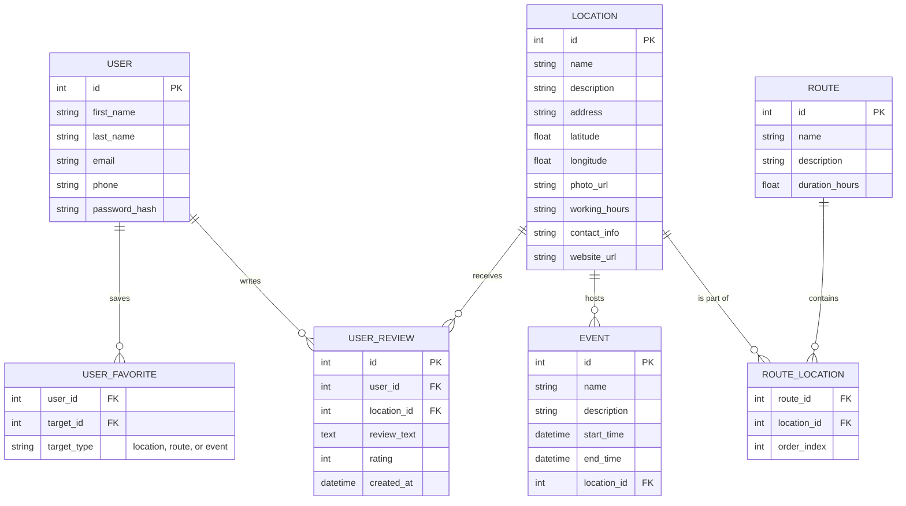

# Схема Базы Данных (ER-Диаграмма)

Ниже представлена ER-диаграмма, описывающая основные сущности системы: `Пользователи`, `Локации`, `События`, `Маршруты`, `Отзывы` и `Избранное`.

```mermaid
erDiagram
    USER {
        int id PK
        string first_name
        string last_name
        string email
        string phone
        string password_hash
    }
    LOCATION {
        int id PK
        string name
        string description
        string address
        float latitude
        float longitude
        string photo_url
        string working_hours
        string contact_info
        string website_url
    }
    EVENT {
        int id PK
        string name
        string description
        datetime start_time
        datetime end_time
        int location_id FK
    }
    ROUTE {
        int id PK
        string name
        string description
        float duration_hours
    }
    ROUTE_LOCATION {
        int route_id FK
        int location_id FK
        int order_index
    }
    USER_FAVORITE {
        int user_id FK
        int target_id FK
        string target_type "location, route, or event"
    }
    USER_REVIEW {
        int id PK
        int user_id FK
        int location_id FK
        text review_text
        int rating
        datetime created_at
    }

    USER ||--o{ USER_FAVORITE : "saves"
    USER ||--o{ USER_REVIEW : "writes"
    LOCATION ||--o{ USER_REVIEW : "receives"
    LOCATION ||--o{ EVENT : "hosts"
    ROUTE ||--o{ ROUTE_LOCATION : "contains"
    LOCATION ||--o{ ROUTE_LOCATION : "is part of"
```
